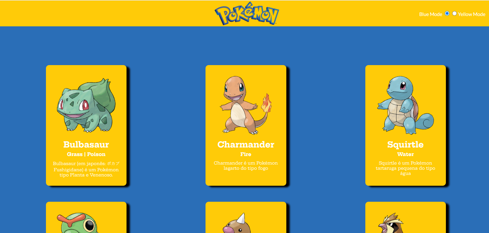
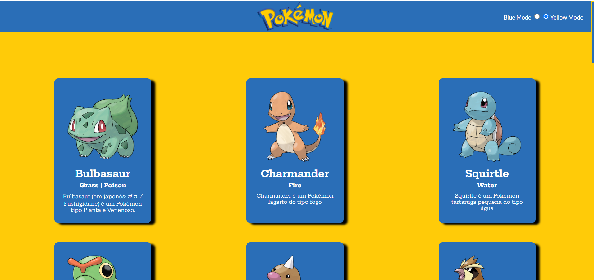

<h1 align="center" style="color:red;">Pokemon</h1>

## Descrição do Projeto 

Projeto com alguns Pokemons, feito sem API, o objetivo é ver algumas caracteristicas dos pokemons ao clicar 

Status do Projeto: Concluido :heavy_check_mark:

## Deploy da Aplicação com GitHub Pages: :dash:
https://nattanjohn.github.io/Pokemon/

## O que a plataforma é capaz de fazer :checkered_flag:

✔️ Dois Temas de Layout

✔️ Abrir um modal

✔️ Totalmente responsivo

  

  

